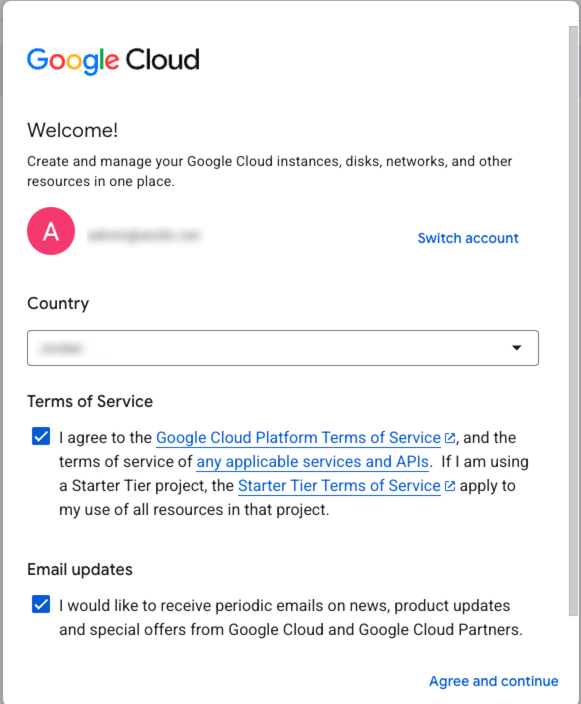
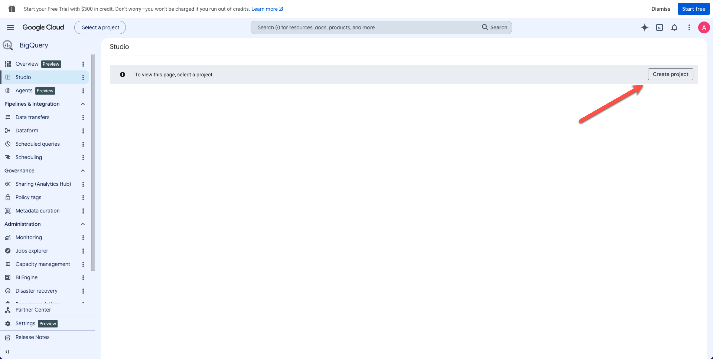
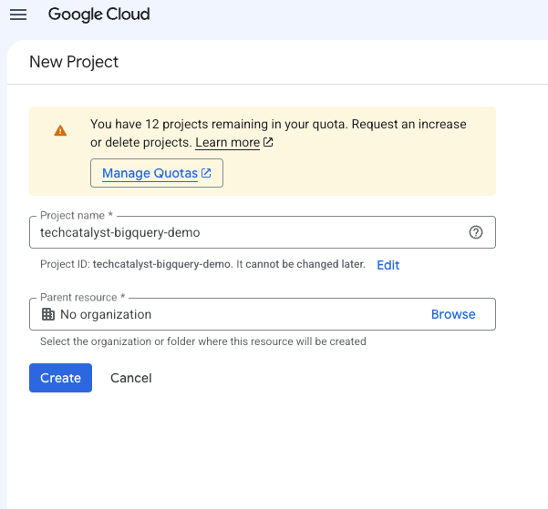
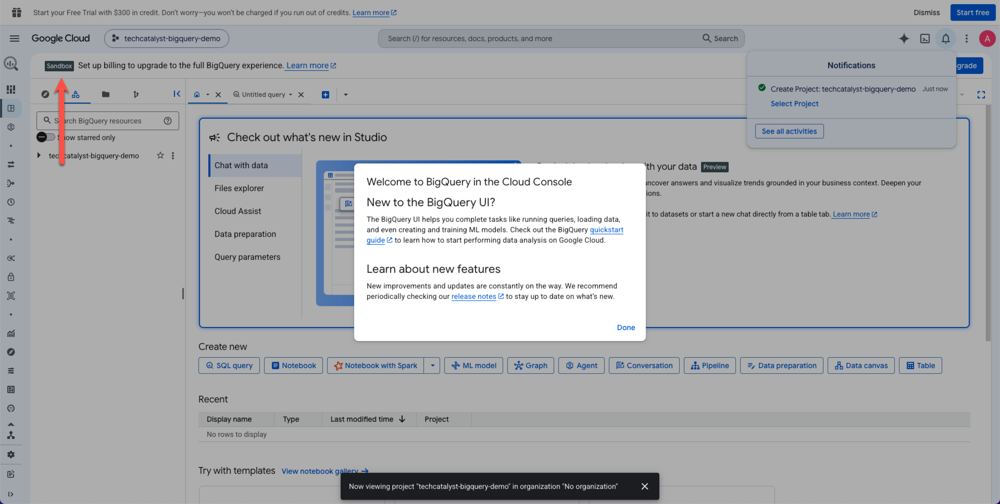
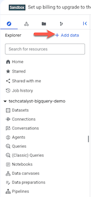
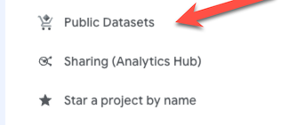
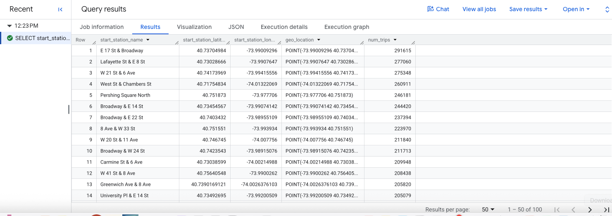
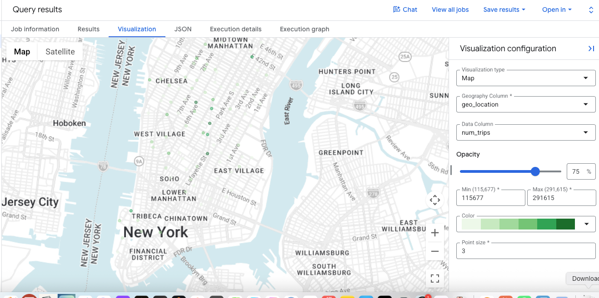

# Week 1 · Day 2 · Activity 1: First Query in BigQuery Sandbox (No Credit Card)

**Duration:** 60 min (plus optional stretch work)  
**Difficulty:** Beginner  
**Format:** Individual (everyone needs their own Google account); sit with your Day 1 teams to help each other  
**Prerequisites:** A Google account, either your **course Google account** or a **personal Gmail**. No credit card, no billing account, no course GCP project needed.

***

## Why this activity

Day 2 is about *cloud fundamentals*: service models, the GCP↔AWS map, and **how the cloud bills you**. So far you've only watched the instructor drive the console. This is your turn to touch a real cloud data warehouse with your own hands, for free, in about five clicks.

**BigQuery Sandbox** lets you query Google's warehouse without a credit card or billing account. You'll run real SQL against the **NYC Citi Bike public dataset** and watch BigQuery estimate how much data each query will process before you run it. In the Sandbox you are not charged, but the same number affects usage and, in a billed project using on-demand pricing, cost. That **bytes processed** number is the whole point of today.

Citi Bike is separate from the NYC Taxi data your teams will use later. It demonstrates the same warehouse workflow: inspect, query, aggregate, and visualize a large public dataset.

> [!IMPORTANT]
> **This is not a SQL lesson.** You'll *paste provided queries* and read the results. You formally learn BigQuery and GoogleSQL in Week 3. Today's goal is the **cloud + cost** muscle: enable a service, navigate the console, and connect a query to its data-processed estimate.

> [!WARNING]
> **AI-Free Zone (Weeks 1–4).** BigQuery Studio has a built-in **Gemini** assistant that can write SQL for you. **Do not use it today.** Don't click "Generate SQL," don't accept autocomplete suggestions of whole statements. Paste the queries given here and type any edits yourself. (You'll use AI assistants deliberately, as a reviewer, starting Week 6.)

> [!NOTE]
> **GoogleSQL only.** GoogleSQL is BigQuery's recommended dialect and the only dialect used in this course. Google began restricting Legacy SQL availability after June 1, 2026. If you find an old tutorial that starts with `#legacySQL` or uses `[brackets]` around table names, ignore it.

***

## What the Sandbox gives you (and its limits)

| You get | The catch |
| :--- | :--- |
| **No credit card / no billing account** | You must sign in with a Google account |
| **1 TB of query processing per month, free** | After the monthly allowance is exhausted, queries are blocked rather than billed |
| **10 GB of active storage, free** | This applies to data stored in your project; the public dataset is not stored in your project |
| Full **GoogleSQL**, public datasets, the real console | **No DML** (`INSERT`/`UPDATE`/`DELETE`/`MERGE`), no streaming, no Data Transfer Service |
| Tables you create persist for **60 days** | They auto-expire, which is fine for a class, don't store anything precious |

> [!TIP]
> **Either account works; the Sandbox is free regardless.**
>
> - **Course Google account:** when you create the Sandbox project, you'll be asked to **select your organization**, choose it and continue. Still no billing, still the free guardrail.
> - **Personal Gmail:** choose **No organization**. Enables instantly with zero friction.
>
> If your course account is locked down by an admin and the org step fails, just switch to a personal Gmail; the lab is identical either way.

***

## Part 1: Enable the Sandbox 

1. Go to **https://console.cloud.google.com/bigquery** and sign in with your chosen Google account.

2. Select your **Country**, accept the **Terms of Service**, and click **Agree and continue**.

   

3. Click **Create project**. Name it `bq-sandbox-<yourname>` (e.g. `bq-sandbox-tarek`). For **Organization**: select your course org if you're on the course account, or **No organization** on a personal Gmail. Click **Create**.

   

   

4. You're back on the BigQuery page. Look for the **Sandbox** banner near the top; that confirms you are in the free, no-billing mode.

   

**Q1:** Did the page ask you for a credit card at any point? In one sentence, why does that matter for a student or a quick proof-of-concept at work?

## Part 2: Find the public data 

BigQuery public datasets are available by default in BigQuery Studio in a project named `bigquery-public-data`. In this tutorial you query the NYC Citi Bike Trips dataset. Citi Bike is a large bike share program, with 10,000 bikes and 600 stations across Manhattan, Brooklyn, Queens, and Jersey City. This dataset includes Citi Bike trips since Citi Bike launched in September 2013.

5. In the left **Explorer** pane, click **+ Add Data**

   

6. In the **Add data** dialog, click  **Public datasets**.

   

7. On the **Marketplace** page, in the **Search Marketplace** field, type `NYC Citi Bike Trips` to narrow your search.

8. In the search results, click **NYC Citi Bike Trips**.

9. On the **Product details** page, click **View dataset**. You can view information about the dataset on the **Details** tab.

10. In the **Explorer** pane, expand `bigquery-public-data` → `new_york`, and select `citibike_trips`. Open these tabs before writing SQL:

    - **Schema:** find the station, time, rider type, and trip-duration columns.
    - **Preview:** inspect a few rows without writing a query.
    - **Details:** find the table size and number of rows.

**Q2:** Is this table small enough to inspect row by row? Why is a query or summary more useful than scrolling through the raw records?


## Part 3: Query a public dataset

In the following steps, you query the `citibike_trips` table to determine the 100 most popular Citi Bike stations in the NYC Citi Bike Trips public dataset. The query retrieves the station's name and location, and the number of trips that started at that station.

The query uses the [ST_GEOGPOINT function](https://docs.cloud.google.com/bigquery/docs/reference/standard-sql/geography_functions#st_geogpoint) to create a point from each station's longitude and latitude parameters and returns that point in a `GEOGRAPHY` column. The `GEOGRAPHY` column is used to generate a heatmap in the integrated geography data viewer.

11. Click **+ → SQL query**.
12. Paste the following query into the query editor. **Before clicking Run**, look at the validator in the lower-right corner. It shows a green check and an estimate such as "This query will process X MB when run."

```sql
SELECT
  start_station_name,
  start_station_latitude,
  start_station_longitude,
  ST_GEOGPOINT(start_station_longitude, start_station_latitude) AS geo_location,
  COUNT(*) AS num_trips
FROM
  `bigquery-public-data.new_york.citibike_trips`
GROUP BY
  1,
  2,
  3
ORDER BY
  num_trips DESC
LIMIT
  100;
```

If the query is valid, then a check mark appears along with the amount of data that the query processes. If the query is invalid, then an exclamation point appears along with an error message.


13. Record the validator's estimate, then click **Run**. The most popular stations are listed in the **Query results** section.



14. Open the **Job information** tab. Compare the estimated bytes you recorded with the bytes the job actually processed.

15. Switch to the **Visualization** tab. This tab generates a map to quickly visualize your results.

16. In the **Visualization configuration** panel:
    1. Verify that **Visualization type** is set to **Map**.
    2. Verify that **Geography column** is set to **`geo_location`**.
    3. For **Data column**, choose **`num_trips`**.
    4. Use **Zoom in** to reveal the map of Manhattan.



**Q3:** What pattern do you notice on the map? What can this map show, and what can it *not* explain by itself?

## Part 4: Think Like a Data Engineer (Rows Returned vs. Data Processed)

Both queries below return only 100 rows. Paste each into a new query tab and record the validator estimate **without running it yet**.

**Query A, one column:**

```sql
SELECT
  start_station_name
FROM
  `bigquery-public-data.new_york.citibike_trips`
LIMIT
  100;
```

**Query B, every column:**

```sql
SELECT
  *
FROM
  `bigquery-public-data.new_york.citibike_trips`
LIMIT
  100;
```

| Query | Rows returned | Validator estimate |
| :--- | ---: | ---: |
| A: one column | 100 | |
| B: every column | 100 | |

**Q4:** Which query processes more data even though both return 100 rows? Why?

**Q5:** Change Query B from `LIMIT 100` to `LIMIT 10`. Does the estimate fall by 90%? Based on what you observed, complete this rule:

> To control BigQuery query usage, select only the __________ you need. `LIMIT` controls the number of __________ returned, but on a non-clustered table it does not necessarily reduce the data read.

> [!TIP]
> BigQuery stores analytical data by column. Asking for fewer columns can mean reading less data. You will explore columnar storage and query optimization in Week 3.

## Part 5: Change, Predict, Observe

Return to the popular-stations query from Part 3.

1. Before editing it, predict what will happen if you change `LIMIT 100` to `LIMIT 10`:
   - How many rows will be returned?
   - Will the most popular station change?
   - Will the validator estimate change significantly?
2. Make only that change, run the query, and compare the result with your prediction.
3. Restore `LIMIT 100` and run the **exact original query** again.
4. Open **Job information**. BigQuery may return the repeated result from its cache, showing `0 B` processed and a faster completion time.

**Q6:** If the second run used cached results, what work did BigQuery avoid? Why could caching matter for a dashboard that runs the same query repeatedly?

> [!NOTE]
> A cache hit is best-effort, so you might not see one every time. That does not mean your query failed.

## What BigQuery Did for You

Match what you just used to the cloud mental model from today:

| Part | What happened |
| :--- | :--- |
| **Data** | Google hosted the public Citi Bike table |
| **Your request** | You supplied a GoogleSQL query |
| **Compute** | BigQuery found resources and executed the query without you managing a server |
| **Result** | BigQuery returned a temporary result that you could inspect and visualize |
| **Usage meter** | The validator and job information reported bytes processed |

**Q7:** Name one responsibility Google managed for you and one decision you still had to make.

## Success Criteria

You are finished with the required activity when you can check every item:

- [ ] The BigQuery page shows the **Sandbox** notice.
- [ ] You inspected the table's schema, preview, and details.
- [ ] The popular-stations query ran and produced a map.
- [ ] You recorded validator estimates for Query A and Query B.
- [ ] You tested one controlled change and compared it with your prediction.
- [ ] You inspected Job information and looked for a cache hit.
- [ ] You answered Q1-Q7 in your notes.

## Exit Ticket

Answer without looking back at the instructions:

1. Why can BigQuery query this dataset without you installing a database server?
2. Why can two queries returning 100 rows process different amounts of data?
3. In one sentence, explain why a data engineer checks the validator before clicking **Run**.

## Bridge to Activity 2

Discuss these questions with your team before moving to the architecture scenarios:

1. What infrastructure did Google manage for you?
2. What decisions did you still control?
3. What created usage or potential cost?
4. When would BigQuery be only one component of a larger solution?

You have now used one managed cloud service. In Activity 2, you will decide what other capabilities are needed for four different business problems.

## Stretch Goals: Explore the Data

These are optional. Paste the query, predict the result first, then run it and interpret the output. You do not need to understand every SQL keyword yet.

### Stretch 0: Read the Query Job Like an Engineer

Before running more SQL, open the **Job information** panel for one completed query and record:

- Job ID
- Duration
- Bytes processed
- Bytes billed, if shown
- Cache hit, if shown

**Why this matters:** in a real project, a query is not just a result table. It is a logged cloud job with metadata you can use to troubleshoot performance, explain cost, and prove what ran.

### Stretch 1: Who Uses Citi Bike?

```sql
SELECT
  usertype,
  COUNT(*) AS num_trips
FROM
  `bigquery-public-data.new_york.citibike_trips`
GROUP BY
  usertype
ORDER BY
  num_trips DESC;
```

Which rider type appears most often? Name one conclusion you **cannot** make from this summary alone.

### Stretch 2: When Do Trips Begin?

```sql
SELECT
  EXTRACT(HOUR FROM starttime) AS start_hour,
  COUNT(*) AS num_trips
FROM
  `bigquery-public-data.new_york.citibike_trips`
GROUP BY
  start_hour
ORDER BY
  start_hour;
```

Where are the peaks? Do they suggest commuting behavior? What other information would you need before making that claim confidently?

### Stretch 3: Check Data Quality

```sql
SELECT
  COUNT(*) AS total_rows,
  COUNTIF(start_station_name IS NULL) AS missing_station_names,
  COUNTIF(tripduration <= 0) AS invalid_durations
FROM
  `bigquery-public-data.new_york.citibike_trips`;
```

Why would a data engineer run checks like these before building a dashboard or pipeline?

<details>
<summary>Hints for the required questions</summary>

- Q2: Compare the row count with the number of rows visible in Preview.
- Q4-Q5: Separate the amount of data **read** from the number of rows **returned**.
- Q6: Look for `0 B` processed or cache information in Job information.
- Q7: Think about servers, scaling, storage, query design, and selected columns.

</details>

## Instructor Notes 

> These are my notes for you to consider/think about.

- **Common misconception:** `LIMIT 10` does not mean BigQuery reads only 10 rows from a non-clustered table.
- **Do not teach SQL syntax deeply:** ask learners to identify what changed and what the output means. Formal GoogleSQL instruction remains in Week 3.
- **Debrief prompts:** "What did Google manage?", "What did you control?", and "What number would you check before running a production query?"
- **Expected observations:** Query B should estimate more processed data than Query A; reducing `LIMIT` usually does not proportionally reduce the estimate; an exact repeat may show a cache hit.

## References

- [Try BigQuery using the sandbox](https://docs.cloud.google.com/bigquery/docs/sandbox)
- [Estimate and control BigQuery costs](https://docs.cloud.google.com/bigquery/docs/best-practices-costs)
- [Use cached query results](https://docs.cloud.google.com/bigquery/docs/cached-results)
- [Legacy SQL feature availability](https://docs.cloud.google.com/bigquery/docs/legacy-sql-feature-availability)
