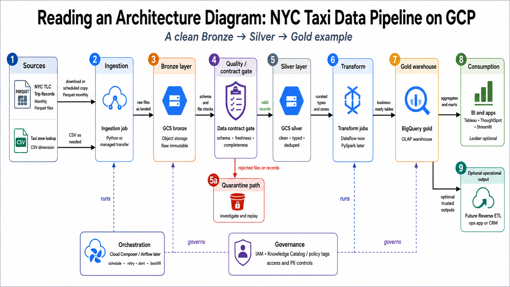
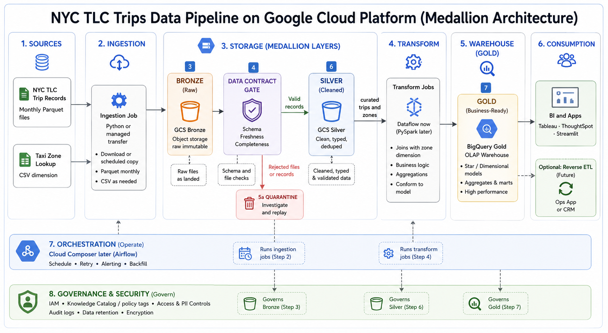
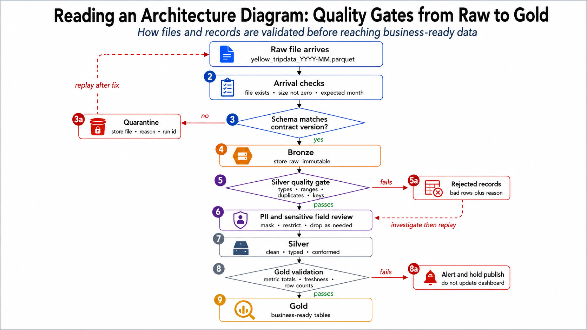
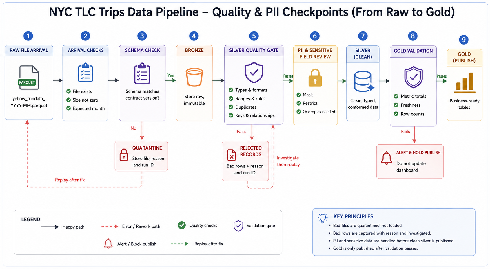

# Week 1 Day 5: Reference Architecture Examples

Use these examples to practice reading architecture diagrams before you build your own Draw.io diagram. They are intentionally simplified: borrow the reasoning style, not the boxes.

> These diagrams are examples to read and compare, not templates to copy. Your team's diagram must come from your own requirements, business slant, and data spec.

## Visual Inventory

| Visual | Type | Why you are looking at it | When to use it |
|---|---|---|---|
| Example 1: NYC Taxi Batch Medallion Pipeline | Draw.io architecture diagram | See how a GCP-first taxi pipeline can be represented at two detail levels | Before Lab A or during the Draw.io demo |
| Example 2: Quality, PII, and Contract Checkpoints | Draw.io flow diagram | See where validation, quarantine, PII review, and publish blocking fit | Before Lab B drawing or during critique |
| Example 3: Pattern Choice Map | Draw.io decision diagram | Decide when batch, streaming, Lambda, Kappa, and medallion apply | Before choosing your team's pattern |
| Example 4: Draw.io Review Checklist | Text checklist | Check whether your own diagram is readable and defensible | Before readout |

---

## Visual 1: NYC Taxi Batch Medallion Pipeline

**Editable Source File:** [nyc_taxi_gcp_reference_architecture.drawio](nyc_taxi_gcp_reference_architecture.drawio)

**Representation A: simple flow view**

**Representation B: zoned architecture view**

Open the editable file in Draw.io / diagrams.net with **File → Open from → Device**.

**What this shows:** A requirement-driven taxi analytics pipeline. Raw monthly files land in bronze, quality and contract checks protect silver, transformations create gold tables, and governed outputs serve dashboards and future operational systems.

**What to notice:**
- The main data path moves left to right from source to consumption.
- Bronze, Silver, and Gold mean different guarantees about the data.
- Quality checks and quarantine are shown on the diagram, not hidden in a paragraph.
- Orchestration and governance are separate from the transformation logic.
- Reverse ETL is shown as optional and future-facing, not required for Week 1.

**How to use this example:** Compare the simple flow view and the zoned architecture view. Ask: which version is easier to read quickly, and which version gives more operational detail? Your team can choose a different representation, but your arrows, zones, quality checks, and trade-offs must be clear.

---

## Visual 2: Quality, PII, and Contract Checkpoints

**Editable Source File:** [quality_pii_contract_checkpoints.drawio](quality_pii_contract_checkpoints.drawio)

**Representation A: compact gate flow**

**Representation B: detailed checkpoint view**

Open the editable file in Draw.io / diagrams.net with **File → Open from → Device**.

**What this shows:** How files and records are checked before they become business-ready data. Bad files are quarantined. Bad rows are rejected with reasons. PII and sensitive fields are handled before clean Silver data is published. Gold tables are only published after validation passes.

**What to notice:**
- File-level failures and row-level failures are different.
- Quarantine means "hold and investigate," not "delete."
- PII review belongs before trusted Silver/Gold outputs are served.
- A failed Gold validation should block dashboard updates.
- Replay paths matter because pipelines must recover from bad data.

**How to use this example:** Use it to decide where your own diagram needs quality checks, PII handling, quarantine, rejected records, alerts, or replay paths. Your final team architecture does not need this much detail everywhere, but it should show the most important failure and governance points.

---

## Visual 3: Pattern Choice Map

**Editable Source File:** [pattern_choice_map.drawio](pattern_choice_map.drawio)

Open this file in Draw.io / diagrams.net with **File → Open from → Device**. It is a decision-support diagram for discussion before students draw their own architecture.

**What this shows:** Freshness drives batch versus streaming. Medallion describes how data is refined and can be used with batch, Lambda, or Kappa patterns.

**What to notice:**
- Medallion does not compete with Lambda or Kappa.
- Most Week 1 taxi designs should start as batch plus medallion.
- Streaming adds complexity and should be justified by a real freshness need.
- The pattern choice should cite consumers, cost, risk, and latency.

**How to use this example:** Place your team's business slant on the map before drawing. If your consumers only need daily or hourly data, explain why batch is enough. If you choose streaming, explain what decision requires lower latency.

---

## Visual 4: Draw.io Review Checklist

**Checklist:**

| Check | What Good Looks Like |
|---|---|
| Requirements visible | The diagram reflects a stated business slant, consumers, freshness, and cost or risk constraints |
| Zones readable | Flow is left-to-right from source to ingest, lake, transform, warehouse, and serve |
| Storage families named | Object storage, OLAP warehouse, operational system, or specialized store are named correctly |
| Arrows labeled | Every arrow says what moves, format, and cadence |
| Quality gates shown | Schema, freshness, duplicate, range, or row-count checks appear at sensible boundaries |
| PII or sensitive fields handled | Masking, access control, cataloging, or removal is placed where it actually happens |
| Orchestration separate | Schedule, dependency, retry, alert, and backfill are shown as run behavior, not confused with transformation |
| Failure path visible | Bad files or rows have a quarantine/rejected-records path |
| Scope defended | The team can explain what it would cut to ship a simple version first |

Use this checklist before your team readout. A professional architecture diagram should be readable by someone who was not in the room when it was drawn.

---

## Instructor Use Notes

- Before Lab A, look at one example briefly, then read a real GCP or AWS reference architecture.
- Before Lab B, remember that copying an example is a weak design. Your diagram must be driven by your business slant and requirements.
- During readouts, use the checklist to keep critique specific and kind: critique the design, not the designer.
